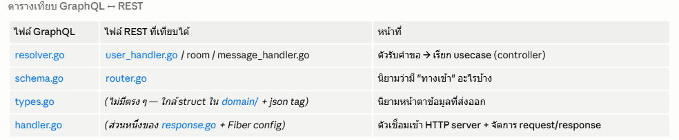
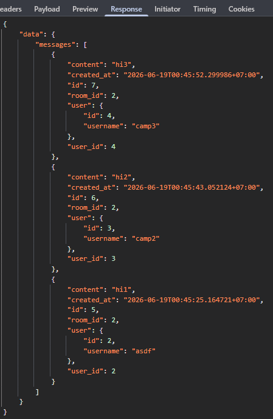

# 💬 Real-time Chat App (Go + React)

> 📖 For project structure, request flow, and setup steps, see [workflow_explanation.md](workflow_explanation.md).

---

## 🧱 Tech Stack

| Layer | Technology |
|-------|------------|
| Backend | Go 1.22+ · Fiber · GORM · PostgreSQL |
| API | REST · GraphQL |
| Frontend | React 19 · TypeScript · Vite · Tailwind CSS |
| Architecture | Clean Architecture (entity / repository / usecase / controller) |

---
### GraphQL 

REST returns a **fixed shape per endpoint**. GraphQL is added on top so the client can
ask for **exactly the fields it needs in a single request** — no over-fetching, no extra round trips.
GraphQL (POST /graphql)


REST คืนข้อมูล รูปร่างตายตัวต่อ endpoint ส่วน GraphQL เพิ่มเข้ามาเพื่อให้ client ขอ เฉพาะ field ที่ต้องการในคำขอเดียว — ไม่ต้อง fetch หลายรอบ  


REST API จะคืน JSON มาใน format ที่เรา fixed ไว้ ดังนั้นเราจะทำการเพิ่ม graphQL ลงในโปรเจคเพื่อให้ Client สามารถเลือกดึงเฉพาะค่าที่ต้องการได้


ตัวอย่างเช่นในโปรเจคนี้ ฟังกฺ์ชัน listMessages ซึ่งมีหน้าที่ดึง ประวัติข้อความในห้องๆ หนึ่งมาแสดงบนหน้าแชท ซึ่งหากใช้ REST API
จะต้องยิงอย่างน้อย 2 รอบ 

- Get ครั้งแรก ดึง record การสนทนาแต่ละก้อน หรือ record ที่เก็บใน table message -> ได้ค่า id(id ของ record นั้น), room_id(ขอวห้องนั้น), user_id(ใครส่ง), content(เนื้อข้อความ), created_at(เวลาส่ง เพื่อให้ client มาเรียง) โดย default ที่ตั้งไว้จะดึง 25 record ล่าสุดก่อน

เมือ่ได้ข้อความสนทนาล่าสุดแล้วจะดูไม่รู้เรื่องจนกว่าจะนำค่าที่ดึงมาจากการดึงครั้งแรก ไปดึงรายชื่อของคนที่ส่งมาแสดง


- Get ครั้งสอง ดึงรายชื่อตาม user_id ทั้งหมดที่มีเพื่อให้หน้าเว็บนำมาแสดง ต้องเขียนฟังกชันรวบตาม ต้องเขียนฟังก์ชันให้รวบรวม id ที่ไม่ซ้ำเพื่อ fetch ทีเดียว และฟังก์ชัน map id กับ ชื่อ ที่ได้คืนมาก่อนแสดงผลด้วย


หากเป็น GraphQL จะสามารถดึง content มาพร้อมกับ username ได้เลย ซึ่ง Resolver จะจัดเรียงมาให้เรียบร้อยแล้ว
จาก graphQL query

**ตัวอย่าง**

```
messages(roomId: 1, limit: 25) {
  content
  createdAt        
  user { username }
}
```
จะได้ response เป็น JSON


```
{ "content": "ข้อความที่ 1", "createdAt": "2026-06-18T10:00:00Z", "user": {"username":"alice"} },
{ "content": "ข้อความที่ 2", "createdAt": "2026-06-18T10:01:00Z", "user": {"username":"bob"} }
```

frontend น่าไป map ต่อได้เลย


Request:



Response:





เทียบให้เห็นภาพ


GraphQL:  fetch → map → เสร็จ


REST:     fetch → ยิงขอ user → สร้าง map → merge → ค่อย map → เสร็จ


## ความสะดวกในการ Implement graphQL
**Key design — GraphQL is just another delivery layer; it calls the same usecases as REST.**
Business logic is never duplicated, which is the whole point of Clean Architecture:


Design หลัก — GraphQL เป็นแค่ delivery layer อีกตัว ที่เรียก usecase ชุดเดียวกับ REST business logic -> ดีต่อ Clean architecture


```
REST handler   ─┐
                ├─► usecase (business logic) ─► repository ─► PostgreSQL
GraphQL resolver ┘
```
จาก ไดอะแกรมจะเห็นว่า GraphQL และ REST ใช้โครงสร้างเดียวกัน เราแค่ต้องเพิ่ม Controller ของ graphQL ซึ่งนิยมเรียกว่า Resolver

## WebSocket 

REST กับ GraphQL เป็นแบบ **ถาม-ตอบ** — client ต้องถามเองทุกครั้ง
WebSocket เพิ่มเข้ามาเพื่อให้ server **ดันข้อความใหม่มาหา client เอง** แบบ real-time (เลิก poll)

ในแชทนี้แบ่งเป็น 2 ช่องชัดเจน:


ส่งข้อความ → REST POST /api/rooms/1/messages (ข้อมูลเข้าทางนี้)
รับข้อความ → WebSocket /ws/rooms/1 (server push ออกมา)


**Design หลัก — WebSocket ก็เป็นแค่ delivery layer อีกตัว ที่ broadcast ผลจาก usecase ชุดเดียวกับ REST**
// usecase ไม่รู้จัก WebSocket เลย รู้แค่ interface `MessageNotifier` (Dependency Inversion):

REST handler     ─┐
GraphQL resolver ─┴─► usecase.Send ─► repository ─► PostgreSQL
                          │
                          └─► MessageNotifier ─► Hub ─► broadcast → ทุก client

**ตัวอย่าง** — เปิด connection ฟังห้อง 1:

```
const ws = new WebSocket('ws://localhost:5173/ws/rooms/1')
ws.onmessage = (e) => console.log(JSON.parse(e.data))
```


พอมีคนส่งข้อความเข้าห้อง 1 (ผ่าน REST) server จะ push ก้อนนี้มาให้ทุก connection

```
{
  "id": 42,
  "room_id": 1,
  "user_id": 1,
  "content": "สวัสดีทุกคน",
  "created_at": "2026-06-18T10:30:00Z",
  "user": { "id": 1, "username": "alice" }
}
```

## 🔌 API Endpoints

### REST API

| Method | Path | Description |
|--------|------|-------------|
| POST | `/api/users` | Create or fetch a user — `{ "username": "..." }` |
| GET | `/api/rooms` | List all rooms |
| POST | `/api/rooms` | Create a room |
| GET | `/api/rooms/:id/messages?page=1&limit=20` | Paginated messages in a room |
| POST | `/api/rooms/:id/messages` | Send a message  |

